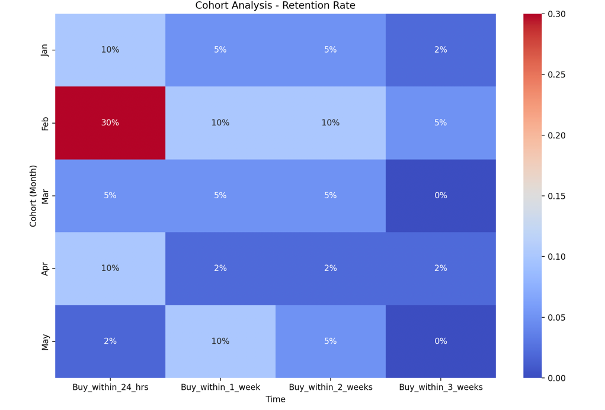
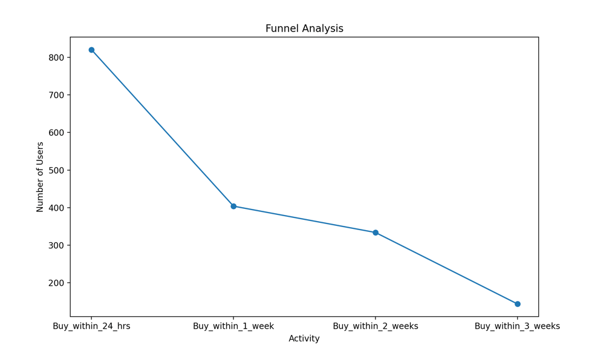

# Community Site Analysis

This project provides a comprehensive analysis of user retention on a community site using Funnel and Cohort Analysis.

## Directory Structure
community-site-analysis/
│
├── community_site_analysis/
│   ├── data/
│   ├── notebooks/
│   ├── scripts/
│   │   ├── cohort_analysis.py
│   │   ├── funnel_analysis.py
│   └── tests/
│       └── test_analysis.py
│
├── README.md
├── LICENSE
├── requirements.txt
└── .gitignore

## Setup

1. Clone the repository:
    ```sh
    git clone <repository-url>
    cd community-site-analysis
    ```

2. Create and activate a virtual environment:
    ```sh
    python -m venv venv
    source venv/bin/activate  # On Windows use `venv\Scripts\activate`
    ```

3. Install the dependencies:
    ```sh
    pip install -r requirements.txt
    ```

## Running the Analysis

- **Cohort Analysis**: Analyze retention rates over time.
    ```python
    from community_site_analysis.scripts.cohort_analysis import cohort_analysis
    import pandas as pd

    data = {
        'Month': ['Jan', 'Feb', 'Mar', 'Apr', 'May'],
        'Qty_blog_readers': [1500, 1200, 300, 2700, 1400],
        'Buy_within_24_hrs': [150, 360, 15, 270, 25],
        'Buy_within_1_week': [75, 120, 15, 54, 140],
        'Buy_within_2_weeks': [75, 120, 15, 54, 70],
        'Buy_within_3_weeks': [30, 60, 0, 54, 0],
        'Click_through_no_buy': [225, 300, 75, 1080, 350],
        'No_click': [945, 240, 180, 1188, 490]
    }

    df = pd.DataFrame(data)
    cohort_analysis(df)
    ```

- **Funnel Analysis**: Analyze user journey steps.
    ```python
    from community_site_analysis.scripts.funnel_analysis import funnel_analysis
    import pandas as pd

    data = {
        'Month': ['Jan', 'Feb', 'Mar', 'Apr', 'May'],
        'Qty_blog_readers': [1500, 1200, 300, 2700, 1400],
        'Buy_within_24_hrs': [150, 360, 15, 270, 25],
        'Buy_within_1_week': [75, 120, 15, 54, 140],
        'Buy_within_2_weeks': [75, 120, 15, 54, 70],
        'Buy_within_3_weeks': [30, 60, 0, 54, 0],
        'Click_through_no_buy': [225, 300, 75, 1080, 350],
        'No_click': [945, 240, 180, 1188, 490]
    }

    df = pd.DataFrame(data)
    funnel_analysis(df)
    ```

- **Automated Execution**: You can also run both analyses using the provided script `run_analysis.py`.
    ```sh
    python community_site_analysis/run_analysis.py
    ```

## Running Tests

To run the tests, use the following command:
```sh
python -m unittest discover community_site_analysis/tests
## Usage

- **Cohort Analysis**: Analyze retention rates over time.
    ```python
    from community_site_analysis.scripts.cohort_analysis import cohort_analysis
    import pandas as pd

    data = {
        'Month': ['Jan', 'Feb', 'Mar', 'Apr', 'May'],
        'Qty_blog_readers': [1500, 1200, 300, 2700, 1400],
        'Buy_within_24_hrs': [150, 360, 15, 270, 25],
        'Buy_within_1_week': [75, 120, 15, 54, 140],
        'Buy_within_2_weeks': [75, 120, 15, 54, 70],
        'Buy_within_3_weeks': [30, 60, 0, 54, 0],
        'Click_through_no_buy': [225, 300, 75, 1080, 350],
        'No_click': [945, 240, 180, 1188, 490]
    }

    df = pd.DataFrame(data)
    cohort_analysis(df)
    ```

- **Funnel Analysis**: Analyze user journey steps.
    ```python
    from community_site_analysis.scripts.funnel_analysis import funnel_analysis
    import pandas as pd

    data = {
        'Month': ['Jan', 'Feb', 'Mar', 'Apr', 'May'],
        'Qty_blog_readers': [1500, 1200, 300, 2700, 1400],
        'Buy_within_24_hrs': [150, 360, 15, 270, 25],
        'Buy_within_1_week': [75, 120, 15, 54, 140],
        'Buy_within_2_weeks': [75, 120, 15, 54, 70],
        'Buy_within_3_weeks': [30, 60, 0, 54, 0],
        'Click_through_no_buy': [225, 300, 75, 1080, 350],
        'No_click': [945, 240, 180, 1188, 490]
    }

    df = pd.DataFrame(data)
    funnel_analysis(df)
    ```
## Example of Results from Analysis
### Cohort Analysis Result

### funnel_analysis Result

## License

This project is licensed under the MIT License - see the LICENSE file for details.